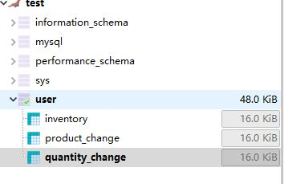
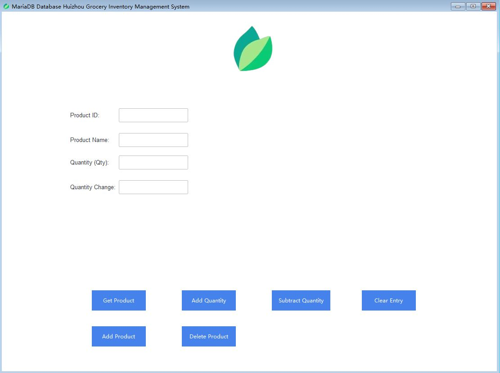

<div align="center">
  <h1 align = "center">Huizhou Grocery Inventory Management System </h1>
</div>

[](/LICENSE)

We revised our code and let IMS run on one LAN network, which means two and more desktops can work together. It will become one simple business app.

We need to run both commands in our terminal.

```shell
pip install ttkbootstrap
```

```shell
pip install pywinstyles
```

```shell
pip install pymysql
```

<br/>
This time we need to go to MariaDB.org to download the database for our Desktop (Laptop). Our testing environment is Windows, and we get Heidi SQL EXE.
<p align="center">
  
</p>
<br/>

When we are installing MariaDB, we will set up the root and default password. You could click a button that lets a remote PC access your MariaDB database, which is important.


<p align="center">
  
</p>

<p align="center">
  
</p>

After you can run Python code on your terminal, you need to run this code below.

```shell
pyinstaller --onefile --name Huizhou-IMS -i logo.png --windowed IMS-MariaDB.py
```

For now, it is the same as SQLite database. Other PCs can not access your MariaDB database on your current PC, even using this app. Why? We need to let our current PC become a server in one LAN network.
<br/>
<br/>
Have you heard of mad-scientists' flask? We are using programmers' flask to let it work. Let us run both commands below.

<br/>

```shell
pip install -U Flask
```

```shell
set FLASK_APP = app
```

<br/>
You need to create app.py in your current working directory and copy this code.
<br/>
<br/>

```shell
from flask import Flask

app = Flask(__name__)

@app.route("/")
def hello_world():
    return "<p>Hello, Flask!</p>"
```


```shell
flask run --host 0.0.0.0 --port 5140
```

Until now, you will get your LAN address like (192.168.1.80). You could test if you can connect 192.168.1.80 in your browser on other PCs. Definitely, all PCs need to work in one router network (some routers may not support data transfer; they will block servers).
<br/>
<br/>
In other PCs, Heidi SQL could change 127.0.0.1 to 192.168.1.80. And you may find you could connect your current MariaDB from other PCs now. 
<br/>
<br/>
Final step is to change python code(host='192.168.1.80'), this simple app could work in all PCs now. Many people may expect it.


